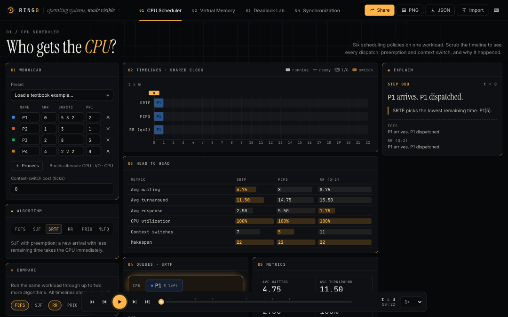
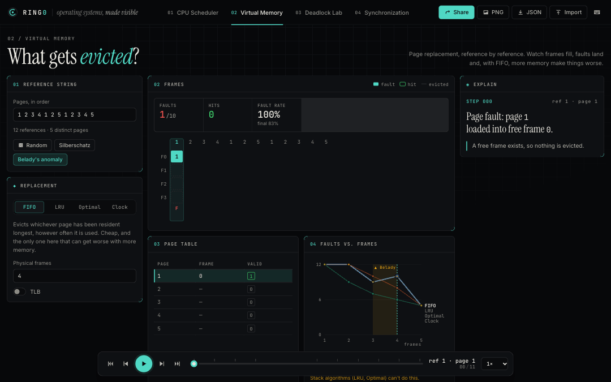
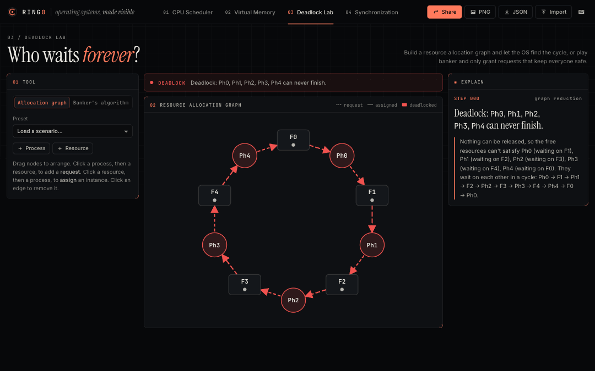
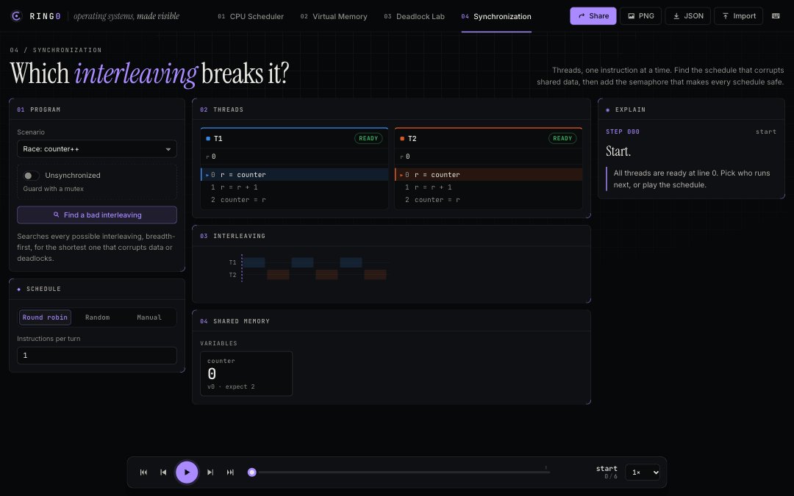

# RING0 — operating systems, made visible

An interactive simulator for the parts of an OS course that are hard to see on a whiteboard: CPU scheduling, page replacement, deadlock and synchronization. Rewind time, compare algorithms on the same workload, and share any scenario as a link.

**Live:** https://shrestha-droid.github.io/ring0/



## What you can do

**CPU Scheduler.** FCFS, SJF, SRTF, Round Robin (adjustable quantum), Priority (preemptive or not, with aging) and MLFQ. Edit the process table, including I/O bursts. The Gantt chart has a lane per process showing running, waiting and blocked time, with context-switch markers; click or drag it to scrub. Compare mode runs up to three algorithms on the same workload with a head-to-head metrics table.

**Virtual Memory.** FIFO, LRU, Optimal and Clock on any reference string, or a seeded random one. The frame grid fills in reference by reference, with Clock's reference bits and hand. There is a page table and an optional TLB. A faults-versus-frames chart highlights Belady's anomaly where it happens; one click loads the classic example.



**Deadlock Lab.** A resource allocation graph you can drag and wire up by clicking. Detection uses graph reduction, so it is correct for multi-instance resources, and it highlights the cycle. It also tells "deadlock" apart from "a cycle, but no deadlock". The Banker's algorithm animates the safety check across the matrices, and you can make requests and commit grants. Presets include the textbook graphs and dining philosophers, both the deadlocking version and the resource-ordering fix.



**Synchronization.** Threads run a tiny instruction set, one instruction per step, so `counter++` visibly splits into load, add and store. Shared memory flags stale copies, and the lost update is caught at the exact store that clobbers it. Step threads by hand, branch the timeline, or press **Find a bad interleaving** to search every schedule for the shortest one that breaks. Then switch on the semaphore and watch every schedule pass. Presets: racy counter, the Silberschatz `count++`/`count--` example, bounded buffer, readers–writers, and opposite lock order.



**Everywhere:**

- **Explain panel.** It says what the OS did at each step and why, with the numbers it used.
- **Time travel.** Play, pause, step, scrub.
- **Share links.** The whole scenario and the current step are encoded in the URL.
- **Export.** PNG of the main visual, or JSON of the scenario (re-importable).
- **Responsive.** It works on phones.

| Keys | |
|---|---|
| `Space` / `K` | play / pause |
| `←` `→` / `J` `L` | step (hold `Shift` for 10) |
| `Home` / `End` | first / last step |
| `[` `]` | slower / faster |
| `1`–`4` | switch module |
| `?` | shortcuts |

## Run it

```sh
npm install
npm run dev        # http://localhost:5173
npm test           # engine tests
npm run build      # type-check, build, pre-render → dist/
npm run e2e        # browser test of every interaction, against the build (uses local Chrome)
```

Requires Node 22 or newer.

## Architecture

```
src/
  engine/        pure, deterministic TypeScript; no React, DOM, clock or unseeded randomness
    core/        Step / Trace / Explanation types, seeded RNG, share-link codec
    scheduler/   one tick loop, six policies, metrics
    memory/      four replacement algorithms, TLB, fault curve, reference generator
    deadlock/    graph reduction + cycle finding, banker's safety and request algorithms
    sync/        register VM, lost-update detection, breadth-first interleaving search
  store.ts       Zustand: one scenario per module + cursor and playback flags
  ui/            React views, one per module, plus the shell and playback bar
```

**Scenario in, trace out.** Every module is a pure function `simulate(params) → { steps, metrics }`. Each step is an immutable snapshot of the whole state, plus an explanation the engine writes at the moment it decides. Rewinding is just indexing the step list, and the Explain panel can never disagree with the algorithm.

**Only the scenario is state.** The store holds the scenario, the cursor and playback flags, all plain JSON. Traces are recomputed from the scenario. Share links (`#s=<lz-string>`) and JSON export are the same envelope, `{ v: 1, module, params }`. Incoming links and files are untrusted: the store only accepts them if the engine can run them.

**Determinism.** Tie-breaks are fixed and documented in the types. Random generators take a seed that lives in the scenario. `purity.test.ts` fails the build if engine code imports React or touches `Date`, `Math.random`, `window` or `document`.

**Rendering.** Plain SVG, with no chart library. The data is small, SVG exports cleanly to PNG and stays accessible, and the bundle stays at about 100 KB gzipped. The default view is pre-rendered at build time and hydrated, so first paint does not wait for JavaScript. Lighthouse (mobile) on the production build scored 100 for performance, accessibility and best practices.

**Tests.** 53 engine tests check results against published examples, and each test comment names its source:

- **Scheduling:** Silberschatz, *Operating System Concepts* 10e, §5.3 (FCFS, SJF, SRTF, priority and RR averages and Gantt charts). MLFQ follows *OSTEP* ch. 8, Fig. 8.3.
- **Paging:** Silberschatz §10.4, FIFO 15, LRU 12 and Optimal 9 faults on the 20-reference string, plus Belady's 9 → 10.
- **Deadlock:** the banker's example and its three requests (§8.6.3.3), the detection example (§8.7.2), and the allocation graphs (§8.3.2).
- **Synchronization:** §6.1 `count++`/`count--` ending at 4, the bounded buffer (§7.1.1), readers–writers (§7.1.2), and opposite-order deadlock (§6.8.3).
- **Properties:** Optimal never loses, LRU and Optimal never show Belady's anomaly, and traces are deterministic and serialisable.

Section numbers refer to the 10th edition; check them against your copy.

More on the decisions behind this in [WRITEUP.md](WRITEUP.md), and the full API in [ARCHITECTURE.md](ARCHITECTURE.md).

## Deploy

Every push to `main` runs the engine tests, builds, runs the browser test, and publishes `dist/` to GitHub Pages (`.github/workflows/deploy.yml`). Asset paths are relative, so the same build also works on any static host.
